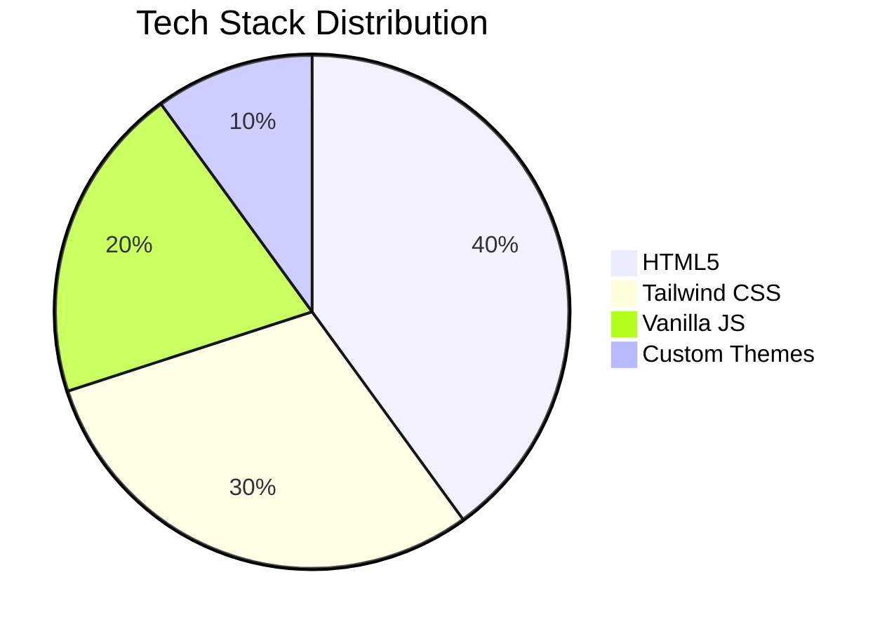

# 🧠 IGNOU Psychology MAPC Study Guides  
<div align="center">  
    
</div>  
<h2>📚 Educational resources for IGNOU's Master of Arts in Psychology (MAPC) program.</h2>
<h4 align="center"><i>Offline-Ready Interactive Solved Previous Year Question Papers for MPC-001 to MPC-006</i></h4> 
<div align="center">
  <a href="https://mohdusaid.github.io/IGNOU-MAPC/"  target="_blank">
    
  </a>
</div>
<br><div align="center"><sup>🧠 Psychological Wizardry Powered by HTML/CSS</sup></div>


---
[](https://github.com/MohdUsaid/IGNOU-MAPC/stargazers) 

## 🔍 Quick Overview  
**A modern, interactive study companion for IGNOU Psychology students**  
- 🌟 **Interactive**: Expandable notes, copy-to-clipboard, progress tracking  
- 📱 **Mobile-First**: Fully responsive design  
- 🌙 **Dark Mode**: Built-in toggle for eye comfort  
- 📦 **No Dependencies**: Pure HTML/CSS/JS – works offline  
- 🎯 **Exam-Focused**: Tagged questions from past papers (2017–2024)  

---


## 🎨 Key Features  

| Feature | Description |  
|--------|-------------|  
| 📝 **Smart Notes** | Save notes directly in the browser |  
| 📋 **Copy Answers** | One-click copy of key definitions |  
| ✅ **Progress Tracking** | Mark topics as "Read" or "Doubt" |  
| 📅 **Exam Tags** | See which topics appeared in past exams |  
| 🧩 **Modular Design** | Each paper as a standalone HTML file |  

---

## 📚 Courses Covered  

### 📘 MPC-001: Cognitive Psychology  
- Wallas' Stages of Creativity  
- Divergent vs. Convergent Thinking  
- Creativity Measurement Techniques  

### 📊 MPC-002: Statistics in Psychology  
- Correlation vs. Regression  
- Parametric vs. Non-Parametric Tests  
- Descriptive Statistics Essentials  

### 🧠 MPC-003: Personality Theories  
- Freud's Structural Model  
- Horney's Neurotic Needs  
- Maslow's Hierarchy of Needs  

### 🤝 MPC-004: Social Psychology  
- Script Theory of Aggression  
- Observational Learning  
- Social Identity Theory  

### 🔍 MPC-005: Research Methods  
- Content Analysis  
- Case Study Method  
- Experimental Design  

### 🧪 MPC-006: Applied Psychology  
- Clinical Psychology Interventions  
- Industrial-Organizational Applications  
- Educational Psychology Strategies  

---

## 🛠 Tech Stack  



---

## 📦 How to Use  

### 🖥 Open in Browser 
Navigate [to this webpage](https://mohdusaid.github.io/IGNOU-MAPC/)  
```bash
https://mohdusaid.github.io/IGNOU-MAPC/
```

---

## 📜 License  
MIT License – see [LICENSE](LICENSE)  

---

## 🤝 Contributing  
We welcome improvements! Here's how:  

1. 🍴 Fork the repo  
2. 🌿 Create a feature branch  
3. 📤 Submit a pull request  

### 🔧 Suggested Contributions  
- Add new exam tags to existing topics  
- Improve CSS animations  
- Create export-to-PDF functionality  

---

## 📢 Made With 💖  
This project was built with:  
- 💻 [VS Code](https://code.visualstudio.com/)  
- 🎨 [Tailwind CSS](https://tailwindcss.com/)  
- 🧭 [Mermaid.js](https://mermaid.js.org/) for diagrams  
- 🌟 Love for Psychology 🧠  

---
---

### ❤️ Support  
Star ⭐ the repo if this helps your studies!  

---  
